# brazil-literacy-lakehouse

Pipeline de dados híbrida (batch + streaming) na AWS, seguindo a Arquitetura Medalhão (Bronze, Silver e Gold), para acompanhar o indicador nacional de alfabetização infantil por estado, município e rede de ensino.

Projeto desenvolvido para o Tech Challenge - Fase 2 (Pós-Tech em AI Scientist), simulando um time de engenharia de dados de uma organização pública de análise educacional.

## Índice

- [Contexto do problema](#contexto-do-problema)
- [O indicador de alfabetização](#o-indicador-de-alfabetização)
- [Arquitetura da solução](#arquitetura-da-solução)
- [Fluxo de dados](#fluxo-de-dados)
- [Tecnologias utilizadas](#tecnologias-utilizadas)
- [Estrutura do repositório](#estrutura-do-repositório)
- [Como rodar](#como-rodar)
- [Decisões arquiteturais e trade-offs](#decisões-arquiteturais-e-trade-offs)
- [Qualidade de dados](#qualidade-de-dados)
- [FinOps, otimização de custos](#finops-otimização-de-custos)
- [Monitoramento](#monitoramento)
- [Aplicação em IA](#aplicação-em-ia)
- [Metodologia de desenvolvimento (Git)](#metodologia-de-desenvolvimento-git)

## Contexto do problema

A alfabetização na idade certa é um dos indicadores mais fortes de trajetória educacional futura. Órgãos públicos de educação precisam acompanhar esse indicador de forma confiável, comparar resultados contra metas estabelecidas e identificar rapidamente municípios e redes de ensino que estão ficando para trás. O problema é que os dados relevantes vêm de fontes heterogêneas, resultados por município, por UF, metas nacionais, microdados de alunos, em formatos e granularidades diferentes, e precisam ser tratados, integrados e disponibilizados de forma confiável para análise.

Este projeto constrói essa pipeline, da ingestão bruta das fontes públicas até uma camada analítica validada, pronta para consumo por dashboards, relatórios ou modelos preditivos.

## O indicador de alfabetização

Os dados usados vêm da tabela Indicador Criança Alfabetizada, publicada pelo INEP através da plataforma [Base dos Dados](https://basedosdados.org/) (dataset `basedosdados.br_inep_avaliacao_alfabetizacao`), derivada do SAEB (Sistema de Avaliação da Educação Básica). Um aluno é considerado alfabetizado quando sua proficiência em leitura ultrapassa um corte de **743 pontos**, valor que este projeto confirmou empiricamente ao recalcular o indicador a partir dos microdados de alunos (ver [Qualidade de dados](#qualidade-de-dados)).

As 6 fontes exigidas pelo desafio e usadas neste projeto:

| Entidade | Tabela de origem | Linhas | Granularidade |
|---|---|---|---|
| UF | `uf` | 145 | Estado, ano e rede |
| Município | `municipio` | 23.995 | Município, ano e rede |
| Meta Alfabetização Brasil | `meta_alfabetizacao_brasil` | 3 | Nacional, por ano |
| Meta Alfabetização por UF | `meta_alfabetizacao_uf` | 81 | Estado, por ano |
| Meta Alfabetização por Município | `meta_alfabetizacao_municipio` | 10.704 | Município, por ano |
| Dados de alunos | `alunos` | 3.867.999 | Aluno individual |

## Arquitetura da solução

Arquitetura híbrida (batch + streaming) sobre um data lake em Parquet, com 3 camadas:

- **Bronze**: dado bruto, como veio da fonte, sem transformação além do particionamento por ano.
- **Silver**: dado tratado, com tipos e nomenclaturas padronizados entre as 6 fontes, código de município normalizado (IBGE para UF), integrado num modelo conformado de 4 tabelas, com validações de qualidade.
- **Gold**: camada analítica, com 5 tabelas prontas para consumo (indicador por município, comparação meta e resultado, evolução temporal, recálculo a partir de microdados de aluno, e materialização do fluxo de streaming), todas com testes de qualidade automatizados.

### Diagrama da pipeline

```mermaid
flowchart LR
    BD[("Base dos Dados\n(Google BigQuery)")]

    subgraph Batch["Ingestao Batch"]
        NB2["02_ingestao_bronze.ipynb"]
    end

    subgraph Stream["Ingestao Streaming"]
        NB3["03_streaming_producer.ipynb"]
        FH["Kinesis Data Firehose\nstream-eventos-alfabetizacao"]
    end

    subgraph BronzeL["BRONZE (S3)"]
        B1[("bronze/\n6 tabelas brutas")]
        B2[("bronze_stream/\neventos por municipio")]
    end

    subgraph SilverL["SILVER (S3)"]
        NB4["04_silver_qualidade.ipynb"]
        S1[("silver/\n4 tabelas tratadas")]
    end

    subgraph GoldL["GOLD (Athena + S3)"]
        NB5["05_gold_athena.ipynb"]
        G1[("gold/\n5 tabelas analiticas")]
    end

    Consumo["Athena SQL / BI / Modelos de IA"]

    BD -->|bd.read_sql, batch unico| NB2 --> B1
    BD -->|eventos derivados| NB3 --> FH -->|conversao JSON para Parquet| B2

    B1 --> NB4
    NB4 -->|normalizacao IBGE, decodificacao de rede,\nmodelo conformado, scripts de qualidade| S1

    S1 --> NB5
    B2 -->|reconciliacao batch x streaming| NB5
    NB5 -->|CTAS idempotente, Parquet+Snappy| G1

    G1 --> Consumo
```



## Fluxo de dados

1. **Ingestão batch** (`02_ingestao_bronze.ipynb`): as 6 fontes são lidas do BigQuery via pacote `basedosdados` e gravadas em Parquet particionado por `ano` no S3 (`bronze/`), sem transformação.
2. **Ingestão streaming** (`03_streaming_producer.ipynb`): eventos de indicador por município são gerados a partir do resultado batch, simulando uma atualização quase em tempo real, e enviados em lote ao Kinesis Data Firehose, que converte JSON em Parquet automaticamente e entrega em `bronze_stream/`.
3. **Silver** (`04_silver_qualidade.ipynb`): normaliza o código IBGE (deriva `sigla_uf`), decodifica e padroniza a coluna `rede` nas 6 fontes usando a tabela oficial `dicionario` do dataset, integra tudo num modelo conformado de 4 tabelas (`silver_municipio`, `silver_uf`, `silver_brasil`, `silver_alunos`) e roda scripts de qualidade (duplicidade, nulos, consistência de chaves).
4. **Gold** (`05_gold_athena.ipynb`): registra as tabelas Silver no Glue Data Catalog e usa CTAS no Athena para materializar 5 tabelas analíticas (indicador por município, meta e resultado, evolução temporal, recálculo por aluno, e o indicador vindo do streaming), com 13 testes de qualidade automatizados.

## Tecnologias utilizadas

| Tecnologia | Papel no projeto | Por que essa escolha |
|---|---|---|
| Google BigQuery (`basedosdados`) | Acesso à fonte de dados | Acesso gratuito (1 TB/mês) aos microdados já tratados pela Base dos Dados, evitando reprocessar microdados brutos do INEP |
| Amazon S3 | Data lake (armazenamento) | Padrão de mercado para data lake, custo por GB baixo, integra nativamente com Athena, Glue e Firehose |
| Parquet + Snappy | Formato de armazenamento | Colunar e comprimido, os 4 milhões de linhas de `alunos` ocupam menos de 140 MB no total do lake |
| Amazon Kinesis Data Firehose | Ingestão streaming | Serviço totalmente gerenciado, com entrega, retry e conversão de formato sem precisar operar infraestrutura de streaming |
| AWS Glue Data Catalog | Metadados/schema | Necessário para o Athena enxergar os arquivos Parquet como tabelas, catalogado via `store_parquet_metadata()` em vez de Crawler, sem custo de execução |
| Amazon Athena | Motor de consulta e construção da Gold | Serverless, paga por dado escaneado, sem cluster para provisionar ou manter, adequado ao volume do projeto |
| Jupyter Notebooks (Python) | Orquestração da pipeline | pandas, `awswrangler`, `boto3` e `basedosdados`, favorecendo iteração rápida e documentação narrativa (markdown) ao lado do código, em vez de um orquestrador dedicado (Airflow, Step Functions) que seria over-engineering nessa escala |
| Git / GitHub | Controle de versão | Uma branch por funcionalidade, um Pull Request por fase, histórico documentando inclusive bugs encontrados e corrigidos |

## Estrutura do repositório

```
brazil-literacy-lakehouse/
├── notebooks/
│   ├── 01_descoberta_fontes.ipynb      # exploracao inicial das fontes no BigQuery
│   ├── 02_ingestao_bronze.ipynb        # ingestao batch -> Bronze
│   ├── 03_streaming_producer.ipynb     # producer de eventos -> Firehose -> Bronze (stream)
│   ├── 04_silver_qualidade.ipynb       # padronizacao, modelo conformado e qualidade -> Silver
│   └── 05_gold_athena.ipynb            # CTAS no Athena, 13 testes de qualidade -> Gold
├── infra/
│   └── s3-lifecycle-athena-results.json  # lifecycle rule (expira resultados do Athena em 14 dias)
├── docs/                                # reservado para diagramas/documentacao adicional
├── quality/                             # reservado para scripts de qualidade extraidos dos notebooks
├── src/{bronze,gold,silver}/            # scaffold inicial para modularizacao futura, nao utilizado nesta entrega (a logica real vive nos notebooks, documentada em celulas markdown)
├── requirements.txt
└── README.md
```

Os scripts de validação e qualidade de dados (duplicidade, nulos, consistência de chaves, sanidade de domínio, integridade referencial) estão implementados como funções reutilizáveis dentro dos notebooks, `checar_qualidade()` em `04_silver_qualidade.ipynb` e `validar()` em `05_gold_athena.ipynb`, em vez de scripts avulsos, para manter a evidência da validação ao lado do código que gera cada tabela.

## Como rodar

1. Clonar o repositório e criar um ambiente virtual Python:
   ```
   git clone https://github.com/JoaoPaulo-66/brazil-literacy-lakehouse.git
   cd brazil-literacy-lakehouse
   python -m venv venv
   venv\Scripts\activate   # Windows
   pip install -r requirements.txt
   ```
2. Configurar credenciais AWS (`aws configure`) com um usuário com permissão para S3, Kinesis Firehose, Glue e Athena, na região `sa-east-1`.
3. Ter uma conta no Google Cloud com acesso ao BigQuery (a `basedosdados` usa OAuth na primeira execução).
4. Rodar os notebooks em ordem, de `02` a `05` (o `01` é só exploração inicial, opcional). Cada notebook documenta em markdown o raciocínio de cada etapa, então dá pra entender a narrativa sem precisar rodar nada.

## Decisões arquiteturais e trade-offs

**Batch vs. streaming**: o desafio pede ingestão híbrida. Dados de metas e resultados consolidados, publicados anualmente, são naturalmente batch. O streaming foi usado para simular atualização quase em tempo real do indicador por município, um cenário realista para um painel operacional que precisa refletir novas medições rapidamente, sem esperar o próximo ciclo de publicação anual.

**Data lake vs. data warehouse**: optamos por um data lake (S3 + Athena) em vez de um warehouse dedicado, como o Redshift. No volume deste projeto, cerca de 140 MB, um warehouse provisionado custaria dezenas de dólares por mês parado, contra frações de centavo do modelo pay-per-query do Athena. Se o volume crescesse por ordens de magnitude com padrão de consulta intenso e recorrente, um warehouse passaria a fazer mais sentido, e esse trade-off seria reavaliado quando o cenário mudar.

**Custo vs. performance/operabilidade**: a orquestração ficou em notebooks executados manualmente, não num orquestrador dedicado (Step Functions, Airflow, Glue Workflows). Para o escopo do desafio isso é suficiente e mantém custo zero. Numa pipeline de produção recorrente, a recomendação seria mover para Step Functions com EventBridge (agendamento), retries e alertas, um trade-off deliberado de simplicidade e custo sobre automação operacional completa.

**IAM de desenvolvimento**: o usuário usado no desenvolvimento tem managed policies amplas (`AmazonS3FullAccess`, `AmazonKinesisFirehoseFullAccess`) para acelerar a iteração. Ponto de atenção documentado: numa versão de produção, isso deveria virar uma policy customizada de privilégio mínimo, escopada aos recursos exatos (bucket, Firehose e tabelas Glue específicos).

**Catalogação sem Glue Crawler**: usamos `wr.s3.store_parquet_metadata()` em vez de Crawler para registrar as tabelas Silver e Gold no Glue Data Catalog. O schema é lido diretamente do footer do Parquet, mais preciso que amostragem, e sem custo de execução (o Crawler cobra por execução, com mínimo de cerca de 10 minutos).

## Qualidade de dados

Validação de qualidade rodou em cada camada, com achados documentados, e não escondidos, sempre que encontrados:

- **Normalização de código e nomenclatura**: código IBGE padronizado (derivação de `sigla_uf`) e a coluna `rede` decodificada via a tabela oficial `dicionario` do dataset em todas as 6 fontes, incluindo a resolução de uma ambiguidade real (mapeamento de `'Pública'` nas tabelas de meta) com evidência empírica dos dados, não suposição.
- **`nivel_alfabetizacao` decifrado empiricamente**: sem documentação oficial, mas confirmado como faixas de aproximadamente 10 pontos sobre `taxa_alfabetizacao`.
- **Divergência real entre resultado e meta**: 3 municípios, todos em 2023, com diferença de `taxa_alfabetizacao` acima de 1 ponto percentual entre a tabela de resultado e a de meta. Mantidos rastreáveis via uma flag booleana (`taxa_alfabetizacao_divergente`) em vez de silenciosamente "corrigidos" sem dado de referência confiável.
- **`proporcao_aluno_nivel_0..8` com cerca de 48% de nulo**: investigado e confirmado como cobertura temporal (a métrica só passou a ser publicada a partir de 2024), não erro de dado. Um achado que ficou pendente desde a Fase 1 e foi resolvido na Fase 4.
- **Corte de 743 pontos confirmado empiricamente**: recalculando o indicador a partir dos 3,8 milhões de registros de aluno, com erro médio de 0,036 ponto percentual contra o indicador publicado, e evidência de que o cálculo oficial usa média ponderada por peso amostral (`peso_aluno`), não média simples (a versão ponderada erra 19 vezes menos).
- **Três bugs reais encontrados pela própria validação, documentados e corrigidos, não removidos do histórico**:
  1. Duplicação na ingestão Bronze de `meta_alfabetizacao_brasil`, causada por uma célula de teste que gravou a tabela isoladamente antes do loop principal gravar de novo, sem `mode="overwrite"`, duplicando todas as linhas.
  2. Coluna do Glue criada com acento (`taxa_alfabetização`) enquanto o producer de streaming gerava a chave sem acento, fazendo com que o primeiro lote completo de eventos fosse gravado com essa coluna 100% nula.
  3. Rótulos de `rede` redigitados manualmente na construção da Gold de streaming em vez de reaproveitados da lógica da Fase 4. A reconciliação batch e streaming acusou 21.728 combinações órfãs antes da correção, e 0 depois.
- **13 testes de qualidade automatizados na Gold**: duplicidade de chave de negócio, nulos em colunas-chave, sanidade de domínio (taxas entre 0 e 100, código IBGE com 7 dígitos, entre outros) e integridade referencial entre tabelas. 13 de 13 aprovados.

## FinOps, otimização de custos

Levantamento com números reais da conta AWS do projeto, não estimados:

| Componente | Uso medido | Custo |
|---|---|---|
| Armazenamento S3 (todas as camadas) | 0,14 GB | **US$ 0,0057/mês** (recorrente) |
| Firehose, ingestão e conversão | 0,12 GB cobrados (23.995 eventos, mínimo de 5 KB por registro) | US$ 0,0057 (lote único) |
| Athena, 43 queries de desenvolvimento | 0,073 GB escaneados | US$ 0,0004 |
| Glue Data Catalog | dezenas de tabelas/partições | US$ 0,00 (dentro do free tier de 1 milhão de objetos) |

**Custo total de construir e rodar a pipeline inteira: cerca de US$ 0,012. Custo recorrente de manter os dados armazenados: cerca de US$ 0,006/mês.**

Nessa escala, o valor do exercício de FinOps não está em economizar dinheiro, já que o valor em jogo é irrisório. Está em demonstrar as decisões que mantêm o custo baixo se o volume crescer:

- **Parquet + Snappy em todas as camadas**, resultando em 4 milhões de linhas ocupando menos de 140 MB.
- **Particionamento seletivo por `ano`**, só nas tabelas Gold onde o padrão de consulta realmente filtra por ano. Tabelas pequenas ficaram sem partição de propósito, para não gerar excesso de arquivos pequenos.
- **Pré-agregação na Gold**: `gold_proficiencia_alunos` resume os 3,8 milhões de registros de `silver_alunos`, para que consultas analíticas não precisem reescanear a tabela bruta repetidamente. Evidência disso: 43 queries de desenvolvimento, incluindo re-execuções por causa de um bug, escanearam apenas 73 MB no total.
- **CTAS idempotente** (`criar_gold()`), evitando reprocessamento acidental e dados duplicados no S3.
- **Zero recursos de computação sempre ligados**: sem Lambda, EMR ou cluster provisionado, toda a arquitetura é serverless ou roda sob demanda via notebook.
- **Lifecycle rule em `athena-results/`** (`infra/s3-lifecycle-athena-results.json`), expirando resultados de query automaticamente em 14 dias. Sem essa regra, os arquivos de resultado do Athena (123 para apenas 43 queries) acumulariam indefinidamente num pipeline em produção rodando por meses.

## Monitoramento

O Firehose tem logging de erro habilitado no CloudWatch (`stream-eventos-alfabetizacao`), capturando falhas de entrega e conversão em produção. Monitoramento de pipeline é explicitamente opcional no desafio, e o restante da observabilidade neste projeto é feito via os scripts de validação de qualidade executados a cada camada, que atuam como um monitoramento pós-fato da integridade dos dados, em vez de um dashboard ao vivo. Numa evolução para produção, o próximo passo natural seria alarmes CloudWatch sobre falhas de entrega do Firehose, falhas de query no Athena e volume de dados processados por execução.

## Aplicação em IA

A camada Gold, já validada e integrada, viabiliza diretamente:

- **Modelos de predição de alfabetização**: `gold_evolucao_temporal` e `gold_proficiencia_alunos` fornecem features de tendência histórica e composição da avaliação por município e rede, utilizáveis para prever quais municípios têm risco de não atingir a meta do próximo ciclo.
- **Análise de desigualdade educacional**: `gold_meta_vs_resultado` permite quantificar e comparar gaps entre municípios e redes de ensino, combinável com fontes socioeconômicas externas (Censo/PNAD do IBGE, FUNDEB) para investigar correlação entre contexto socioeconômico e desempenho.
- **Políticas públicas baseadas em dados**: um indicador consolidado, íntegro e com qualidade auditada (13 testes automatizados) é a base necessária para qualquer priorização de investimento educacional orientada por dados, a parte menos visível, mas mais crítica, de qualquer iniciativa de IA aplicada a políticas públicas.

## Metodologia de desenvolvimento (Git)

Uma branch por funcionalidade, um Pull Request por fase, mergeados para `main` em sequência:

| Branch/PR | Conteúdo |
|---|---|
| `feat/bronze` | Ingestão batch das 6 fontes |
| `feat/streaming` | Producer, Firehose e validação do streaming |
| `feat/silver` | Padronização, modelo conformado e qualidade |
| `fix/bronze-escrita-duplicada` | Correção do bug de duplicação encontrado na Fase 4, isolada do trabalho de Silver |
| `feat/gold` | 5 tabelas Gold via CTAS no Athena, com 13 testes de qualidade |
| `feat/finops` | Lifecycle rule para expirar resultados do Athena |

Bugs reais encontrados ao longo do projeto (ver [Qualidade de dados](#qualidade-de-dados)) foram documentados no histórico e nos notebooks, em vez de silenciosamente corrigidos e escondidos, inclusive quando isso significou manter uma primeira tentativa com erro visível no notebook final, como evidência de como a validação de qualidade pegou o problema antes de chegar em produção.
